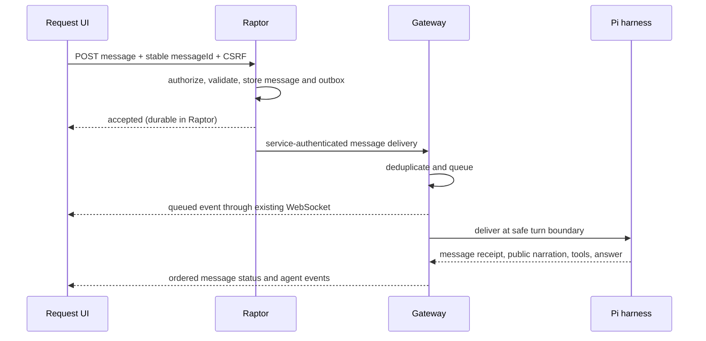

# Request conversation design

Status: proposed implementation contract; awaiting review of this written specification.
Base: main at af0a1dab444956d04a746e37d8be804caa21f216 (PR #70).
Branch: feat/request-conversation, created directly from that main commit.

## Goal and approved direction

Turn the existing assistant-ui Request transcript into a conversation. Users can ask follow-up questions, add context and steer checks while seeing actual agent narration and tool activity. Raptor checks identity and participation rights; Gateway owns durable delivery and execution; the harness uses Pi sessions. Chat input is not a permission grant or an approval decision.

The user approved this direction and the following checks in this chat: valid login, Request participation, bounded nonempty messages with stable IDs, and lifecycle-aware admission. Concrete defaults below are design decisions for review, not existing deployed behavior.

## Verified baseline

- Raptor records creator_id on requests, has user/admin roles and browser-session/CSRF middleware. Request reading currently permits signed-in users; reading does not imply permission to send.
- Raptor already has a transactional outbox and Gateway service authentication. Its dispatcher currently handles request dispatch and signals, not conversational messages.
- The browser already receives Gateway events over a request-bound read-only WebSocket. Write frames close that connection; keep that contract.
- The live harness creates a new Pi SessionManager, prompts once, then disposes the session. Its tool allowlist contains six scoped reads for application.question.
- Pi 0.99.2 exposes prompt, steer, followUp and SessionManager.open. steer/followUp expand skill commands and templates, so untrusted web text must not be passed through those expansions unchecked.
- Gateway has one live runtime slot, an exclusive driver lease, attempt fencing, per-attempt checkpoints and a global selected checkpoint. Recovery does not automatically replay interrupted inference.

These facts come from current source, not the recovered historical handoff.

## Approach

Extend the existing Raptor outbox, Gateway execution journal, Pi harness and assistant-ui runtime. This preserves the approved transport and operation authorization boundary.

Alternatives considered: browser write tickets would put admission and revocation policy in two services; a separate T3 chat service would split Request identity, execution and conversation ownership. Neither is needed for this slice.

## Admission and permissions

Initial send policy: Request creator or current admin, checked by Raptor on every submission. Other signed-in viewers keep read access but cannot send. A shared participant model can follow later. The browser receives canSend and a reason from the Request view; disabling the composer is only UX, never the authorization control.

Expose POST /api/v1/requests/{id}/messages under existing authenticated, CSRF-protected browser middleware. Body is exactly {messageId, text}; messageId must be UUID. Text must be valid UTF-8, nonblank, at most 2,000 Unicode code points and 8,192 UTF-8 bytes. Do not rewrite valid text. Reject unknown fields and oversized bodies. No attachments, command modes, model selection or role fields in this slice.

Assign actor identity from the session, never from the body. A unique (requestId, messageId) identifies one immutable message. The same authorized actor and exact text returns its existing receipt; conflicting content or actor returns 409. Check idempotency before current lifecycle rejection, so retrying an already accepted message remains possible after the Request changes state.

In one transaction, lock the Request, enforce lifecycle policy and a maximum of 20 outstanding messages, store the message and enqueue its outbox record. Reject further messages with 429 while that Request is at capacity. The response is 202 with messageId and accepted status; this means durable acceptance, not agent processing. Gateway applies the same per-Request outstanding bound and deterministic deduplication. Successful or interrupted terminal messages release capacity.

Raptor rejects unsupported non-agent operations. The first implemented conversation operation is application.question; existing direct operations remain unchanged. Raptor status can lag Gateway, so Gateway rechecks lifecycle authoritatively; a later rejection must become a visible per-message failure, not a silent outbox retry forever.

## Persistence and delivery

Raptor owns author identity, original text, admission time and outbox. Gateway owns queued/delivered/answered/interrupted/rejected status, attempt/session association and public progress. Do not log message bodies or credentials in diagnostics. Public transcript text uses existing secret redaction; private queue storage is subject to the same known-secret checks before model delivery. Known credential-bearing messages are rejected rather than delivered with their credentials. This does not claim detection of arbitrary user secrets.

Add additive migrations for Raptor request_messages and Gateway conversation/messages tables. Give application roles only the table privileges required by these endpoints and workers. Existing request definitions and hashes stay immutable. Message text is separate from the original definition, with a canonical hash used for idempotency.

Extend the outbox with a dedicated message topic and client method; do not reuse approval/retry signals as chat. Gateway POST /v1/requests/{id}/messages is service authenticated and is not public browser ingress. Payload carries messageId, actorId, text and admission time. If initial Request dispatch has not arrived, retry delivery after dispatch; never instantiate an unbound execution from an arbitrary message payload. Classify transient failures for retry and permanent conflicts/rejections for durable reporting. Delivery retries reuse the same identity and text.

Each Gateway queue insertion and status change atomically writes a public event. Use kind=message with details containing messageId, role, status and the bound attempt when available. User message text is the public summary. An acknowledged delivered event means the harness has appended the user input to its session, not merely that Gateway wrote a file. Keep message delivery state independent of execution status.

Use monotonically increasing per-Request input sequence numbers assigned at admission in Raptor and forwarded to Gateway. Consume accepted messages in that order; outbox reordering must not overtake an earlier undelivered message. The authenticated service payload binds sequence, actor and content; collisions fail. A durably rejected earlier message is an explicit skipped entry. Gateway checks gaps instead of guessing missing input.

## Runtime and lifecycle

| State | New-message behavior |
|---|---|
| queued / preparing | Persist; consume after the original prompt starts |
| running | Persist; deliver FIFO after current tool calls settle, before a later model turn |
| checkpointing / cleaning up | Queue for a subsequent attempt; do not inject into a settling harness |
| waiting for permission / PR review | Accept and queue; chat alone cannot clear the pause or resume mutations |
| completed with verified session and confirmed cleanup | Start a continuation attempt using that Request's session |
| failed / cancelled / recovery required / cleanup uncertain | Reject new input with an explicit reason; existing accepted input becomes interrupted or remains visibly waiting for recovery |

Permission/PR waits are future operation states: this slice preserves their boundary but does not invent those workflows in application.question.

Retain the global live slot and exclusive lease. Serialize attempts within a Request. Every continuation gets a new attempt ID, deadline and scoped credential, while preserving the original Request binding. Each attempt has the existing 90-second, 10-turn and 1,024-output-token limits. Follow-ups do not reset these limits mid-attempt. When current limits are reached, unanswered queued messages remain for a later attempt only after confirmed cleanup and a verified continuation checkpoint. A failed attempt does not trigger automatic model replay.

Extend LiveRuntime with an idempotent DeliverMessage operation for Native and AX runtimes. The Gateway writes a bounded private input inbox; the harness emits a message receipt into progress. Use stable message IDs, turn receipts and the existing lease fencing. The polling callback queues input without blocking the Pi event callback. For web text, disable skill/template expansion and extension-command execution using a verified SDK path; if the SDK cannot express that safely, adapt the raw user-message queue rather than using the interactive command parser.

A final answer must not race with new input. Before entering checkpointing, atomically close that attempt's input admission window. Later messages remain queued for the next attempt. Capture an answered receipt tied to message ID(s) only when a corresponding final response is recorded; do not label delivered input answered because an unrelated earlier answer finished. Retain per-turn final answers in transcript history; the Result tab shows the latest completed turn without erasing earlier answers.

## Session and checkpoint isolation

Persist an opaque Pi session ID bound to exactly one Request. Resume through SessionManager.open using a validated path within the restored private sessions directory; never use continueRecent or a browser-supplied path. Validate restored session identity and expected Request association before making any model call.

Record a per-Request continuation checkpoint that contains its latest verified session. The existing global selected checkpoint continues serving credential/bootstrap compatibility; it is not proof that a specific conversation is present. Restore the Request's verified checkpoint for continuation, obtain/refresh provider authentication through the existing controlled path, then issue fresh attempt access. Do not restore another Request's transcript as context or revive expired attempt credentials. Reject unavailable or mismatched conversation state visibly. Pre-feature completed Requests without a recorded session association are view-only until explicitly recreated; do not guess a session from archive recency.

On idle completion, checkpoint and clean up the sandbox as today. Do not hold a sandbox indefinitely for chat. A later message starts a fresh sandbox and resumes the specific conversation. Before continuing, re-fetch current Request/catalog context and live evidence under fresh credentials; prior observations remain historical, not current health evidence.

## Crash and replay semantics

Raptor-to-Gateway delivery is at-least-once with durable deduplication. Pi delivery uses stable IDs and private receipts. After a process crash, a message that might have reached a model is marked interrupted when receipt/checkpoint evidence cannot establish its outcome; do not automatically replay ambiguous input or claim exactly-once model execution. Recovery retains existing cleanup/fencing rules. Explicit user retry creates a new message ID with visible linkage to the interrupted message.

On page refresh, fetch persisted message history and merge it with Gateway replay using stable IDs. Namespace Raptor input sequences separately from Gateway progress sequences. An accepted message absent from Gateway appears once as awaiting delivery; it is replaced by the canonical Gateway event when delivery succeeds. Never use the input sequence as a WebSocket replay cursor.

## Frontend

Reuse the installed assistant-ui composer and user-message primitives. Replace the rejecting onNew handler with the Raptor message endpoint; enable it only when canSend is true. Optimistic text is labeled sending, 202 changes it to accepted, Gateway events advance its state. Network timeout retains the same message ID for retry. Keep drafts scoped to the selected Request in memory; clear on logout and do not store tokens in URLs or browser storage.

Preserve public narration, expandable tool groups, current navigation cancellation, snapshot fallback and direct WebSocket ticket renewal. Show the active attempt's execution state separately from conversation state. A previously complete socket may have closed: after message acceptance, the frontend asks Raptor for a fresh read ticket and replays Gateway events from its last valid cursor. Other viewers discover continuations through the existing saved-history refresh, then reconnect when the execution is active. Approval buttons remain platform controls.

## Verification and rollout

Acceptance requires creator/admin authorization and CSRF denials; input bounds; idempotent conflict and lost-ack retry; ordered outbox delivery including gaps/rejections; no cross-Request delivery; concurrent send/settle race; queue capacity; safe plain-text SDK delivery including slash-like input; Native/AX parity; exact-session restoration; new-attempt access; lost lease; ambiguous receipt recovery; secret handling; multiple per-turn answers; frontend navigation/logout isolation; and composer status/reconnect tests using the actual production bundle.

Use the pinned real Pi SDK with deterministic provider/MCP fixtures, disposable PostgreSQL and local browser tests. A deployed continuation acceptance test must separately verify ingress and checkpoint restoration on the actual runtime; fixture tests are not deployment evidence.

Roll out additive schemas, Gateway and harness together, then Raptor admission and frontend behind a conversation feature flag defaulting off. Advertise conversation capability from Gateway; Raptor only enables admission when it observes compatible runtime support. Old deployment combinations remain view-only. Do not expose new write routes through public Gateway ingress. Enabling the flag requires passing local/CI contracts and a reviewed runtime acceptance result. No Terraform changes or new cloud provisioning are part of this design.

## Scope limits and source anchors

This slice adds text conversation to application.question. It does not expand the tool catalog, add infrastructure mutations, implement skills/PR approvals, add attachments or change the existing Request read policy. Future operations can reuse the message transport while retaining their own operation authorization checks.

Source anchors: components/raptor/migrations/001_initial.sql (requests, outbox); components/raptor/internal/auth/http.go (Browser); components/raptor/internal/requests/outbox.go (DispatchPending); components/agent-gateway/internal/execution/live_worker.go (start/finish); components/agent-gateway/internal/execution/live_store.go (SelectedCheckpoint); components/agent-gateway/internal/execution/live_journal.go (SaveLiveCheckpoint); components/agent-harness/live-question.mjs (session setup/disposal); installed pi-coding-agent 0.99.2 core/agent-session.d.ts and core/session-manager.d.ts (input/resume APIs); components/raptor/worklog-ui/src/index.tsx (readonly runtime). Historical recovered materials are context, not implementation evidence.
